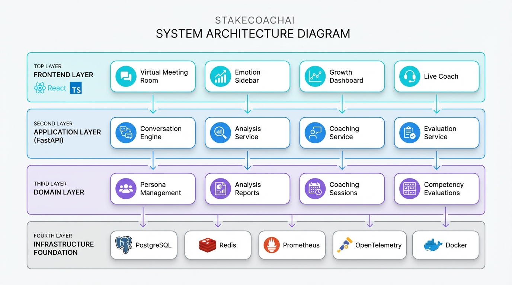
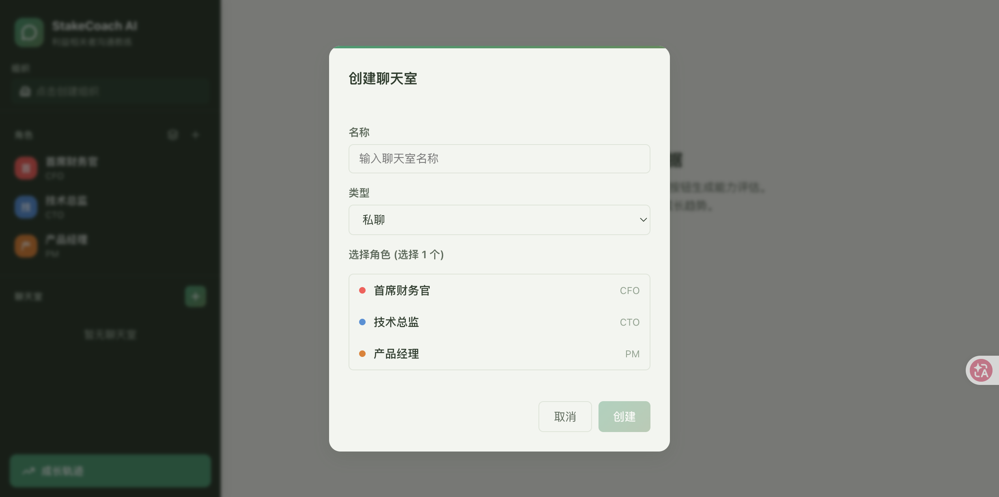
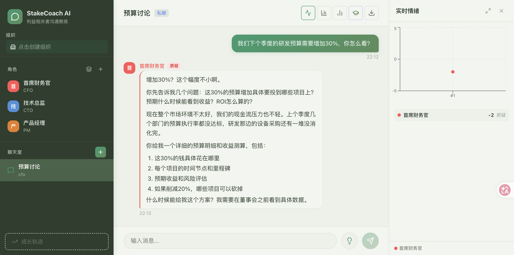
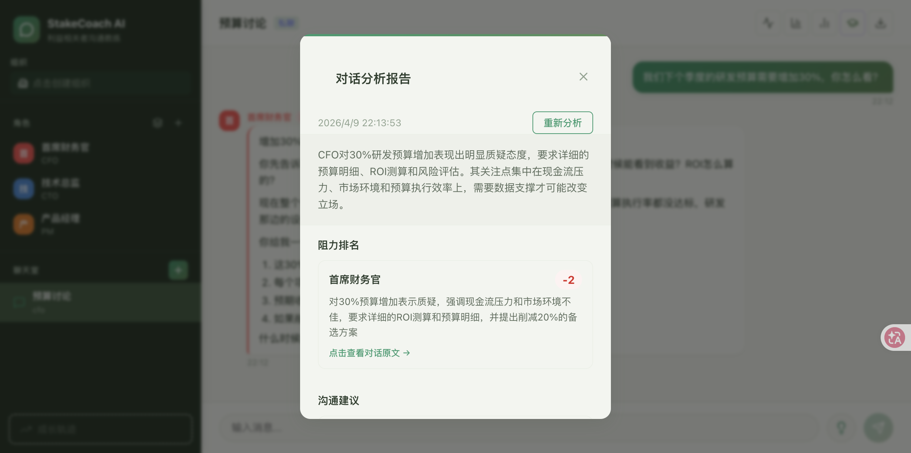
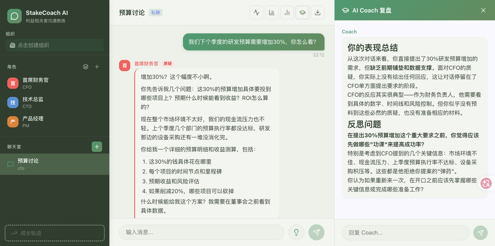

<div align="center">

<a href="https://github.com/guwanhua/StakeCoachAI">
  
</a>

# StakeCoachAI

**高风险对话的AI彩排场**

[](https://python.org)
[](https://fastapi.tiangolo.com)
[](https://react.dev)
[](https://www.typescriptlang.org/)
[](LICENSE)

---

[功能特性](#-核心功能) · [快速开始](#-30秒启动) · [架构设计](#-技术架构) · [路线图](#-roadmap)

---

<!-- STAR_INDICATOR -->


<!-- STAR_BUTTON -->

<a href="https://github.com/guwanhua/StakeCoachAI">
  
</a>

</div>

---

## 背景问题

> 你精心准备了方案，走进会议室。
> CTO第二页就打断：「这和Q3路线图冲突。」
> 接下来30分钟，你在被动��火。
> 会后邮件：「方案暂缓，下季度再议。」

**这不是技术问题，是沟通问题。**

PMI研究：56%的项目失败源于沟通不畅。但现实是——**高风险对话没有彩排机会**。

| 传统方式 | 问题 |
|:---|:---|
| 角色扮演工作坊 | 贵、频次低、不够真实 |
| 沟通技巧课程 | 知道≠做到 |
| 找同事模拟 | 碍于面子，无法施压 |

---

## StakeCoachAI 是什么？

一个用AI驱动的**沟通彩排系统**。

在真实会议前，你可以在虚拟会议室中反复演练：
- AI角色会**打断你、质疑你、带着隐藏议程博弈**
- 实时看到每个角色的**情绪变化**
- 对话中卡住？**一键求助教练**
- 结束后获得**六维度能力评估**
- 追踪你的**成长轨迹**

> 把沟通失误的代价，从真实会议室转移到练习场。

---

## 核心功能

<div align="center">
  
</div>

### 实时演练系统

创建聊天室，选择利益相关者角色，开始模拟对话：

<div align="center">
  
</div>

AI角色会根据角色设定做出真实反应——质疑、施压、带着隐藏议程博弈：

<div align="center">
  
</div>

实时查看每个角色的情绪变化曲线：

<div align="center">
  
</div>

### LLM-as-Judge 评估框架

每次对话后，AI从六个维度评估你的表现：

| 维度 | 评估内容 |
|:---|:---|
| **说服力** | 论点的逻辑性和说服力 |
| **情绪管理** | 压力下的情绪调控能力 |
| **倾听回应** | 理解并回应对方关切的能力 |
| **结构化表达** | 表达的逻辑清晰度 |
| **冲突处理** | 化解分歧、达成共识的能力 |
| **利益对齐** | 识别并整合多方利益的能力 |

<div align="center">
  
</div>

### AI Coach 复盘

对话结束后，AI教练对你的表现进行深度复盘，给出核心改进建议和反思问题：

<div align="center">
  
</div>

### 成长追踪系统

<div align="center">
  
</div>

### 组织关系图谱

角色不是孤立的个体——他们之间有权力关系、联盟和历史恩怨。

```
     ┌─────────┐
     │  CTO   │ ◄──── 权力压制 ────┐
     └────┬────┘                    │
          │                       │
          │ 信任                   │
     ┌────▼────┐                  │
     │  你     │ ◄───── 隐藏议程 ──┘
     └────┬────┘
          │
          │ 历史分歧
     ┌────▼────┐
     │   PM   │
     └─────────┘
```

AI会根据这些关系做出反应——PM反对你，可能因为CTO已经表态。

---

## 30秒启动

```bash
# 一键启动（Docker）
git clone https://github.com/guwanhua/StakeCoachAI.git
cd StakeCoachAI
docker-compose up -d

# 访问前端
open http://localhost:5173
```

```bash
# 本地开发
# 后端
cd backend && uv sync && uv run python main.py

# 前端（新终端）
cd frontend && npm install && npm run dev
```

---

## 技术架构

<div align="center">
  
</div>

---

## 为什么选择 StakeCoachAI？

| | StakeCoachAI | 其他方案 |
|:---|:---|:---|
| **真实性** | AI有情绪、有隐藏议程、有组织关系 | 静态脚本，过于理想化 |
| **即时反馈** | 对话中可求助教练，实时获得建议 | 只有事后总结 |
| **科学评估** | LLM-as-Judge六维度评估 | 无评估或主观打分 |
| **成长追踪** | 跨会话趋势分析，可视化进步 | 无历史追踪 |
| **组织政治** | 角色间有权力关系和联盟博弈 | 角色相互独立 |

---

## Roadmap

- [ ] 更多评估维度（跨文化沟通、谈判技巧等）
- [ ] 角色市场（预设的经典角色包）
- [ ] 团队协作模式（多人实时演练）
- [ ] 语音对话支持
- [ ] 移动端适配

---

## 参与贡献

欢迎贡献！查看 [CONTRIBUTING.md](CONTRIBUTING.md) 了解详情。

1. Fork 本仓库
2. 创建功能分支 (`git checkout -b feature/amazing-feature`)
3. 提交更改 (`git commit -m 'feat: add amazing feature'`)
4. 推送并创建 Pull Request

---

## 许可证

[MIT](LICENSE) © 2024

---

<!-- CTA_SECTION -->

<div align="center">

**如果这个项目对你有帮助，请给一个 Star**

你的支持是我持续更新的动力

<a href="https://github.com/guwanhua/StakeCoachAI">
  
</a>

**[回到顶部](#readme-top)**

</div>
