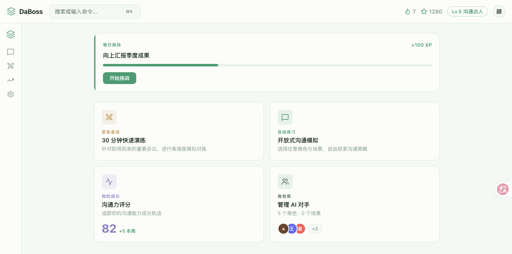
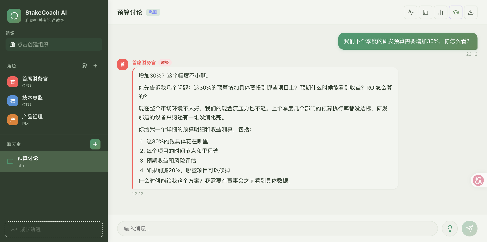
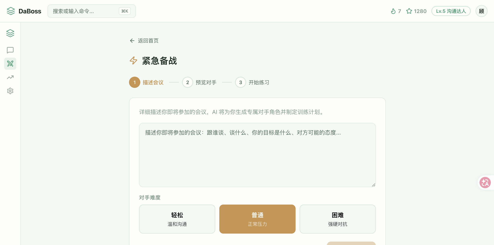
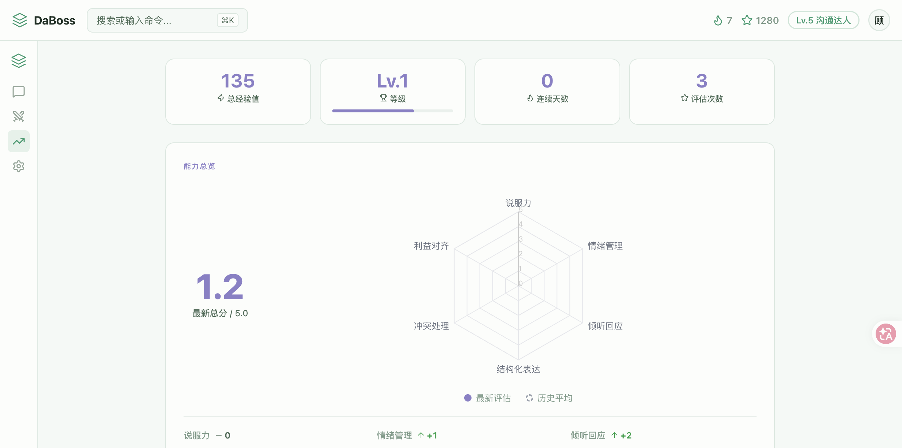
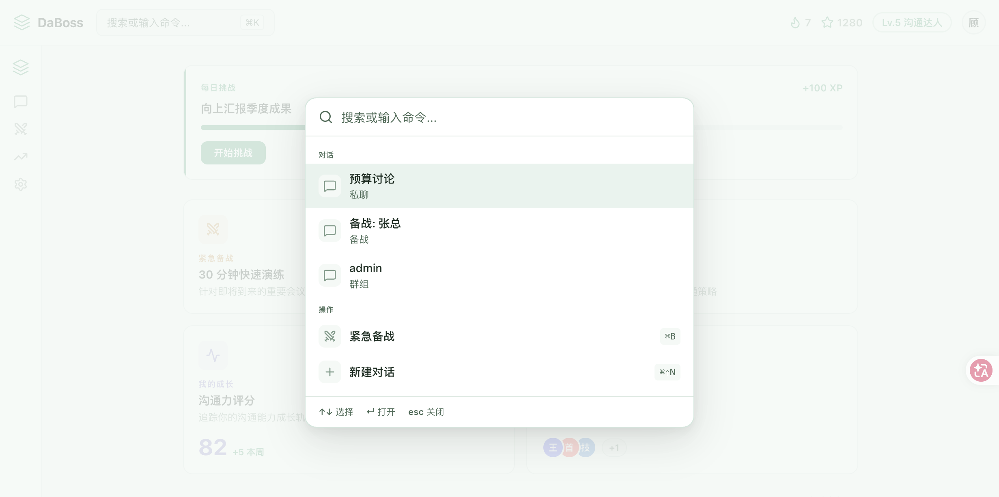
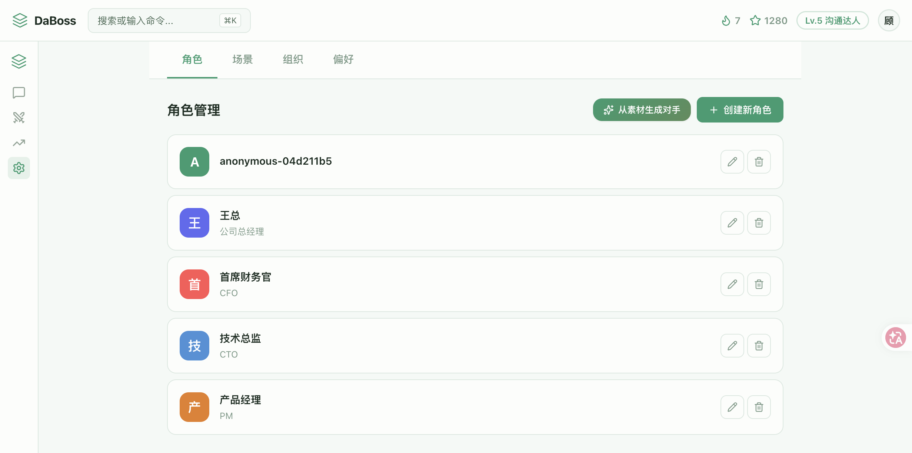

<div align="center">

<a name="readme-top"></a>

<h1>DaBoss — 打Boss</h1>

<p><strong>职场牛马人的会前练习场 —— 用 AI 模拟你的老板，把高风险对话变成可重复的练习。</strong></p>

<p>
喂入聊天记录和会议纪要，AI 帮你还原那个真实的 Boss。<br/>
开会前先打一遍，反复过招，直到找到最优策略再上场。
</p>

[](https://python.org)
[](https://fastapi.tiangolo.com)
[](https://react.dev)
[](https://www.typescriptlang.org/)
[](LICENSE)

---

[功能特性](#-核心功能) · [快速开始](#-30秒启动) · [页面导览](#-页面导览) · [技术架构](#-技术架构) · [路线图](#-roadmap)

---



</div>

---

## 背景问题

> 你精心准备了方案，走进会议室。
> CTO第二页就打断：「这和Q3路线图冲突。」
> 接下来30分钟，你在被动救火。
> 会后邮件：「方案暂缓，下季度再议。」

**这不是技术问题，是沟通问题。**

项目失败的头号原因不是技术——是沟通。PMI 研究显示，**56% 的项目风险源于沟通不畅**。一个关键会议的失误，可能意味着几个月的工作付诸东流。

**DaBoss** 用 AI 创造了一个「安全但真实」的练习场——角色会打断你、质疑你、带着隐藏议程和情绪跟你博弈。你可以反复练习同一个场景，直到找到最优策略，然后带着准备好的方案走进真实会议室。

---

## 核心功能

### 首页仪表盘

登录即看，一目了然：每日挑战、快捷入口、最近对话、技能成长路径。按 `Cmd+K` 全局搜索，秒速直达任何功能。

<div align="center">
  
</div>

### 沉浸式对话演练

三栏布局：左侧房间列表，中间实时对话，右侧智能上下文面板（对手画像、情绪走势、实时评分）。AI 角色会根据角色设定做出真实反应——质疑、施压、带着隐藏议程博弈。

<div align="center">
  
</div>

### 紧急备战模式

重要会议前 30 分钟，三步快速演练：

1. **描述会议** — 输入你要谈什么、对方是谁、难度选择
2. **AI 生成对手** — 自动创建高度还原的对方角色，支持微调
3. **限时对练** — 12 轮模拟对话，AI 围绕训练重点施压
4. **话术纸条** — 自动生成实战话术，一键复制或下载为图片

<div align="center">
  
</div>

### LLM-as-Judge 六维评估

每次对话后，AI 从六个维度评估你的表现：

| 维度 | 评估内容 |
|:---|:---|
| **说服力** | 论点的逻辑性和说服力 |
| **情绪管理** | 压力下的情绪调控能力 |
| **倾听回应** | 理解并回应对方关切的能力 |
| **结构化表达** | 表达的逻辑清晰度 |
| **冲突处理** | 化解分歧、达成共识的能力 |
| **利益对齐** | 识别并整合多方利益的能力 |

### 成长追踪中心

六维雷达图、等级经验值系统、技能成长路径、历史评价卡片，全方位追踪沟通能力进步。完成评估后可生成「沟通力名片」分享。

<div align="center">
  
</div>

### Cmd+K 命令面板

按 `Cmd+K`（或 `Ctrl+K`）全局呼出命令面板，搜索对话、快速跳转、一键新建。支持键盘导航，老用户效率神器。

<div align="center">
  
</div>

### 角色与组织管理

在设置页统一管理 AI 对手角色、场景模板、组织架构与人物关系。角色不是孤立的个体——他们之间有权力关系、联盟和历史恩怨，AI 会据此做出反应。

<div align="center">
  
</div>

### 语音对话

像打电话一样练习沟通——点击录音说话，AI 角色用独立音色语音回复。

| 能力 | 说明 |
|:---|:---|
| **语音输入** | 点击录音 / VAD 自动检测语音起止 |
| **语音输出** | 每个角色独立音色，逐句流式播放 |
| **多厂商支持** | TTS: MiniMax / ElevenLabs；STT: OpenAI Whisper 兼容 |

---

## 页面导览

| 路由 | 页面 | 说明 |
|:---|:---|:---|
| `/` | 首页仪表盘 | 每日挑战、快捷入口、最近对话、技能路径 |
| `/chat/:roomId` | 沉浸式对话 | 三栏布局：房间列表 + 对话 + 上下文面板 |
| `/battle-prep` | 紧急备战 | 三步向导：描述会议 → 生成对手 → 实战演练 |
| `/growth` | 成长中心 | 雷达图、等级经验、技能路径、评价历史、名片 |
| `/settings` | 设置 | 角色管理、场景管理、组织架构、偏好 |

全局功能：`Cmd+K` 命令面板、顶栏等级/XP/连续天数、响应式移动端适配。

---

## 30秒启动

```bash
git clone <repo-url> && cd DaBoss
docker-compose up -d

# 访问前端
open http://localhost:5173
```

```bash
# 本地开发
# 后端
cd backend && uv sync && uv run python main.py

# 前端（新终端）
cd frontend && npm install && npm run dev
```

---

## 技术架构

<div align="center">
  
  <p><em>6 个模块各司其职：练习 → 诊断 → 反思 → 成长 的完整闭环</em></p>
</div>

| 层 | 技术 |
|:---|:---|
| **前端** | React 19 + TypeScript + Vite + React Router v6 |
| **样式** | 薄荷绿设计系统 (CSS Custom Properties) + Lucide Icons |
| **图表** | Recharts (六维雷达图) |
| **实时通信** | Server-Sent Events (SSE) |
| **后端** | FastAPI + SQLAlchemy + Alembic |
| **AI** | Claude (Anthropic SDK)，支持多 LLM 扩展 |
| **语音** | MiniMax/ElevenLabs TTS + OpenAI Whisper STT |

### 前端架构

```
frontend/src/
├── pages/           # 5 个路由页面 (Home, Chat, BattlePrep, Growth, Settings)
├── components/
│   ├── layout/      # TopBar, NavRail, BottomTabBar, CommandPalette, ConfirmDialog
│   └── chat/        # MessageList, ChatInput, ContextPanel, CoachingPanel, AnalysisPanel
├── hooks/           # useChat, useVoice, useCoaching, useAnalysis, useGrowth, useRooms
├── contexts/        # AppContext (全局状态), ChatContext (对话状态)
├── services/        # API 客户端, 音频播放
└── styles/          # 设计令牌 (薄荷绿主题)
```

---

## 为什么选择 DaBoss？

| | DaBoss | 其他方案 |
|:---|:---|:---|
| **真实性** | AI有情绪、有隐藏议程、有组织关系 | 静态脚本，过于理想化 |
| **即时反馈** | 对话中可求助教练，实时获得建议 | 只有事后总结 |
| **科学评估** | LLM-as-Judge六维度评估 | 无评估或主观打分 |
| **成长追踪** | 等级经验值 + 技能路径 + 雷达图趋势 | 无历史追踪 |
| **组织政治** | 角色间有权力关系和联盟博弈 | 角色相互独立 |
| **效率工具** | Cmd+K 命令面板，键盘快捷键 | 纯鼠标操作 |

---

## Roadmap

- [x] 多页面路由架构 (React Router)
- [x] 薄荷绿设计系统 + 响应式布局
- [x] 首页仪表盘 + 游戏化 (等级/XP/连续天数/技能路径)
- [x] Cmd+K 全局命令面板
- [x] 紧急备战模式（会前快速模拟 + 话术纸条）
- [x] 沟通力名片（6维评分社交分享卡片）
- [x] 语音对话支持（MiniMax / ElevenLabs TTS + OpenAI Whisper STT）
- [x] 移动端底部导航栏适配
- [ ] 更多评估维度（跨文化沟通、谈判技巧等）
- [ ] 角色市场（预设的经典角色包）
- [ ] 团队协作模式（多人实时演练）
- [ ] 深色模式切换

---

## 参与贡献

欢迎贡献！

1. Fork 本仓库
2. 创建功能分支 (`git checkout -b feature/amazing-feature`)
3. 提交更改 (`git commit -m 'feat: add amazing feature'`)
4. 推送并创建 Pull Request

---

## 许可证

[MIT](LICENSE) © 2024

---

<div align="center">

**如果这个项目对你有帮助，请给一个 Star**

你的支持是我持续更新的动力

**[回到顶部](#readme-top)**

</div>
