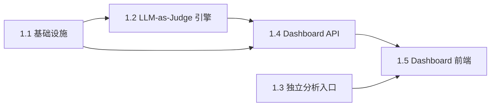

# Epic 1: Growth Dashboard — LLM-as-Judge 多维能力评估 + 成长轨迹

## 概述

**背景**: 用户完成模拟对话后，只能看到单次 session 的分析报告，每次练习孤立，无法形成"练习→评估→改进→再练习"的闭环。
**价值**: 用户能看到自己沟通能力的多维评分和成长趋势，明确薄弱环节，获得针对性的改进建议。
**范围**: LLM-as-Judge 6 维能力评估、独立分析入口、能力雷达图、统计总览、维度趋势、跨 session 成长洞察。
**不含**: 多用户/多租户、Persona 置信度评分、真实对话导入、成长洞察持久化。

## Story 列表

### Story 1.1: CompetencyEvaluation 基础设施

**用户故事**: 作为开发者，我需要 CompetencyEvaluation 的领域实体、数据库表和仓储实现，以便后续 Story 可以持久化和查询能力评估数据。

#### 验收标准
- [ ] `CompetencyEvaluation` dataclass 包含 id, report_id, room_id, scores(dict), overall_score(float), created_at `验证: pytest 实体实例化 → 字段类型正确`
- [ ] `stakeholder_competency_evaluations` 表含 id, report_id(FK UNIQUE), room_id(FK), scores(JSON), overall_score(REAL), created_at(TIMESTAMPTZ) `验证: DB alembic upgrade head → 表和索引存在`
- [ ] `CompetencyEvaluationRepository` ABC 定义 create, get_by_report_id, list_all 方法 `验证: pytest ABC 不可直接实例化`
- [ ] SQLAlchemy 实现注册到 UnitOfWork `验证: pytest async with uow → competency_evaluation_repository 可访问`

**参考**: docs/plans/2026-04-08-growth-dashboard.md §DB Schema
**依赖**: 无

---

### Story 1.2: LLM-as-Judge 能力评估引擎

**用户故事**: 作为用户，我希望每次生成分析报告后，系统自动用 LLM 对我的沟通表现进行 6 维度能力评分，以便我了解自己的具体能力水平。

#### 验收标准
- [ ] `GrowthService.evaluate_competency(report_id)` 加载对话记录和 persona 信息，调用 LLM 按 6 维 rubric 评分 `验证: pytest mock LLM → 返回合法 JSON → CompetencyEvaluation 被持久化`
- [ ] LLM prompt 包含完整的 6 维度评分标准（1-5 分描述），输出 JSON 含 score/evidence/suggestion `验证: pytest prompt 文本包含 persuasion/emotional_management/active_listening/structured_expression/conflict_resolution/stakeholder_alignment`
- [ ] overall_score 为 6 维分数的算术平均值 `验证: pytest scores={每维3分} → overall_score=3.0`
- [ ] 幂等：同一 report_id 重复调用不产生重复记录 `验证: pytest 调用两次 → DB 中只有 1 条记录`
- [ ] 分析报告生成后自动以 background task 触发能力评估 `验证: API POST /rooms/{id}/analysis → 后台日志出现 evaluate_competency`
- [ ] LLM 调用使用 temperature=0.2 `验证: pytest mock LLM → 验证 temperature 参数`

**参考**: docs/plans/2026-04-08-growth-dashboard.md §LLM-as-Judge Prompt
**依赖**: Story 1.1

---

### Story 1.3: 独立分析入口

**用户故事**: 作为用户，我希望在聊天室 header 有一个独立的"分析"按钮，可以只做分析+能力评估而不启动 coaching 对话。

#### 验收标准
- [ ] 聊天室 header 出现"分析"按钮（BarChart2 图标），与 AI Coach 按钮并列 `验证: Browser .chat-header-actions button[title="分析"] → exists`
- [ ] 点击"分析"按钮 → 调用 POST /rooms/{id}/analysis → 显示分析结果摘要（summary + resistance ranking） `验证: Browser 点击分析按钮 → 出现分析结果展示区域`
- [ ] 分析进行中显示 loading 状态，按钮禁用 `验证: Browser 点击后 → 按钮 disabled`
- [ ] 无消息时点击分析 → 提示"暂无消息可分析" `验证: API POST /rooms/{id}/analysis 空消息 → 返回错误码`

#### 前端验收标准
- [ ] 分析结果展示包含：摘要、阻力排名（persona + score + reason）、有效论点、沟通建议 `验证: Browser .analysis-result 内含 .resistance-ranking, .effective-arguments, .suggestions`
- [ ] 分析结果可关闭 `验证: Browser 点击关闭 → 分析结果区域消失`

**参考**: docs/plans/2026-04-08-growth-dashboard.md §现状说明
**依赖**: 无（复用已有 analysis API）

---

### Story 1.4: Growth Dashboard API

**用户故事**: 作为前端，我需要后端提供 Growth Dashboard 聚合数据接口和成长洞察生成接口，以便渲染 Dashboard 页面。

#### 验收标准
- [ ] `GET /api/v1/stakeholder/growth/dashboard` 返回 overview（total_sessions, total_evaluations, avg_overall_score, latest_score）、evaluations 列表、dimension_trends `验证: API GET /growth/dashboard → code=0, data 含 overview/evaluations/dimension_trends`
- [ ] overview.total_sessions = 聊天室总数 `验证: API 创建 3 个 room → total_sessions=3`
- [ ] evaluations 按 created_at 降序，每条含 room_name（从 room 关联查出） `验证: API 有 2 条评估 → evaluations 长度=2 且含 room_name`
- [ ] dimension_trends 为 6 个维度各自的 [{date, score}] 时间线 `验证: API 有 3 条评估 → dimension_trends.persuasion 长度=3`
- [ ] 无评估数据时返回空结构（overview 全 0，空数组） `验证: API 空库 → overview.total_evaluations=0, evaluations=[]`
- [ ] `POST /api/v1/stakeholder/growth/insight` 调用 LLM 生成跨 session 成长洞察文本 `验证: API POST /growth/insight → code=0, data.insight 为非空字符串`
- [ ] 成长洞察 prompt 包含所有评估的分数时间线和最近 3 次 evidence/suggestion `验证: pytest mock LLM → prompt 内容包含分数数据`
- [ ] 评估不足 2 条时调用洞察 → 返回提示"练习次数不足" `验证: API 1 条评估 → POST /growth/insight → 返回友好提示`

**参考**: docs/plans/2026-04-08-growth-dashboard.md §API 设计
**依赖**: Story 1.1, Story 1.2

---

### Story 1.5: Growth Dashboard 前端

**用户故事**: 作为用户，我希望在 sidebar 看到"成长轨迹"入口，点击后在主区域看到能力雷达图、统计卡片、维度趋势和成长洞察，以便追踪我的沟通能力变化。

#### 验收标准
- [ ] Sidebar 底部（RoomList 下方）出现"成长轨迹"按钮（TrendingUp 图标） `验证: Browser .sidebar button.growth-btn → exists`
- [ ] 点击"成长轨迹"→ main content 区域渲染 GrowthDashboard，不显示聊天视图 `验证: Browser 点击成长轨迹 → .growth-dashboard exists, .chat-view not exists`
- [ ] 点击某个聊天室 → 退出 Dashboard 回到聊天视图 `验证: Browser 点击 room → .chat-view exists, .growth-dashboard not exists`

#### 前端验收标准
- [ ] 4 个统计卡片：练习次数、评估次数、平均分、最新分 `验证: Browser .growth-stats .stat-card → count=4`
- [ ] 能力雷达图使用 recharts RadarChart，展示 6 个维度 `验证: Browser .recharts-radar → exists`
- [ ] 雷达图显示最新评估（实线）和历史平均（虚线）两层 `验证: Browser .recharts-radar-polygon → count>=2`
- [ ] 各维度趋势区域显示 6 个维度的分数时间线 `验证: Browser .dimension-trends .trend-row → count=6`
- [ ] "生成成长洞察"按钮，点击后调用 POST /growth/insight → 显示 LLM 返回文本 `验证: Browser 点击生成洞察 → .growth-insight-content 出现文本`
- [ ] 洞察生成中显示 loading 状态 `验证: Browser 点击后 → .insight-loading exists`
- [ ] 无评估数据时显示 empty state + CTA 跳转新建聊天室 `验证: Browser 空数据 → .growth-empty exists`
- [ ] Dashboard 样式与现有 UI 风格一致（暖色专业主题） `验证: Browser 视觉检查`

**参考**: docs/plans/2026-04-08-growth-dashboard.md §前端 Dashboard 布局
**依赖**: Story 1.3, Story 1.4

---

## 依赖关系

**Epic 依赖**: 无
**技术依赖**: recharts（已安装）、LLM Port（已有）、Alembic migration

## 参考文档

- Plan: [docs/plans/2026-04-08-growth-dashboard.md](../plans/2026-04-08-growth-dashboard.md)
