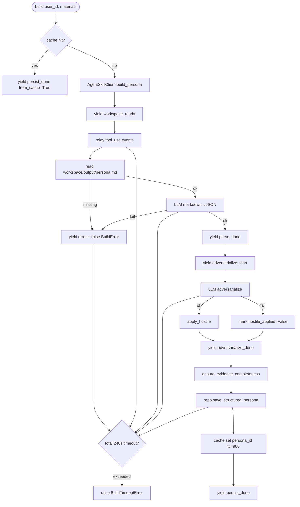

# Story 2.4 执行计划 — PersonaBuilderService 编排 + 对抗化后处理

**Story**: Epic 2 / Story 2.4
**日期**: 2026-04-13
**Owner**: wanhua.gu
**依赖**: Story 2.1 (AgentSkillClient), Story 2.2 (Persona v2 + repo), Story 2.3 (persona_migrator 中的 parse_llm_json 可复用)
**阻塞**: Story 2.5 (SSE API — 将消费 BuildEvent 流)

> Flow C — 跨层编排 + 新外部 prompt + 新 JSON schema + 超时 + Redis 幂等。实现后同步到 `docs/plans/2026-04-13-2.4-persona-builder-service.md`。

## Context

Story 2.1/2.2/2.3 已就位：
- `AgentSkillClient.build_persona(...)` 可用，yield 原生 `AgentEvent`（type: system/assistant_text/tool_use/tool_result/result）；workspace 自动隔离和清理
- `StakeholderPersonaRepository.save_structured_persona(...)` 可持久化 v2 Persona
- `persona_migrator.parse_llm_json` / `build_persona_v2` 已有 markdown→5-layer LLM 解析能力（可复用）

缺口：当前 agent 产出 **markdown**（colleague-skill 最后一步写 `output/persona.md`），但 DB 要求 **5-layer 结构化 JSON + 证据链 + 对抗化注入**。Story 2.4 的任务是把这三件事串起来，并对外以**流式 BuildEvent 序列**暴露进度。

### 关键设计取舍（已与 Story 2.1 实现协调）

- AgentSkillClient 返回的是 tool_use / assistant_text 事件而非最终 persona — 我们要在 agent 流结束后**读取 workspace 里的产物**（或由 agent 在最后一条 result 事件里带 final text），再解析
- 读 workspace 产物需要 workspace 在 agent 结束后 **still exist** — 现有 `AgentSkillClient` 会 schedule_cleanup (5min delay)，但 yield 结束后 cleanup 未必发生。安全做法：在 finally 里立即读取 output 文件
- 需要一个 mapper：`markdown persona → 5-layer JSON`。**决策**：不额外调 LLM 做解析（降低成本 + 延迟）— 改让 skill 直接输出 JSON（修改 skill 的 correction_handler prompt）？❌ 工作量大。**改为**：新加一步 LLM parse 调用（复用 persona_migrator.parse_llm_json + build_persona_v2），但这需要 LLM。**权衡**：
  - (A) 让 agent 输出 markdown + JSON 两个文件 — 需改 skill
  - (B) 让 agent 输出 markdown，parse 阶段再调一次 LLM 转 JSON — 多一次 LLM 调用但 skill 不需改
  - (C) 只用 LLM 做对抗化，JSON 解析用正则/手写解析器 — 脆弱
- **采用 (B)**：`parse_done` 阶段独立调用 LLM，复用 `persona_migrator` 的解析能力。这让"结构化解析"和"对抗化注入"是两个独立 LLM 调用，语义清晰，独立失败恢复

---

## §0 Triage 分级

| # | 问题 | 答案 |
|---|------|------|
| 1 | 单一用户目标？ | YES（编排 persona 构建流程） |
| 2 | 单一业务模块？ | YES（stakeholder） |
| 3 | 不改 DB schema？ | YES |
| 4 | 不改公共 API？ | YES（Story 2.5 做 API） |
| 5 | 不改 domain 规则？ | YES |
| 6 | 不涉及外部系统？ | **NO** — AgentSDK + 新 LLM prompt（对抗化）+ 新 JSON schema + Redis 幂等缓存 |
| 7 | 不涉及权限/幂等/状态流转？ | **NO** — 6 阶段事件状态机 + 240s 总超时 + try/finally 清理 + Redis 缓存 + LLM schema 降级 |
| 8 | 少量文件 ≤ 2 层？ | **NO** — service + prompt + event schema + mapper + cache adapter + tests |

**→ Flow C**（3 个 NO）。

### Scope Challenge 四问

- **能不能只做一半？** 不能。AC 强制 6 阶段事件序列必须完整；对抗化 + evidence 合成 + 持久化是一个闭环
- **有没有更轻的替代方案？** 考虑过"不做对抗化，只做解析 + 持久化"（AC2/AC3/AC4 全砍），但 AC3/AC4 是 Epic 核心价值"对抗化"的唯一表达点，砍掉等于废 Epic 2
- **能不能拆？** 可以，但拆得越多 Story 2.5 API 越难拼接。一次做完保证 SSE 有稳定契约
- **这次必须产出的最小集合？**
  1. `application/services/stakeholder/persona_builder_service.py` 含 `build()` async generator
  2. `application/services/stakeholder/prompts/adversarialize.md` (4 规则段)
  3. `application/services/stakeholder/build_events.py` 统一 BuildEvent dataclass + 类型常量
  4. `application/services/stakeholder/adversarializer.py` pure function: `apply_hostile(persona, llm_json) -> Persona`
  5. Redis 幂等缓存封装（简单 adapter）
  6. 覆盖 8 个 AC 的测试

### 本次必须产出

- Application service: `persona_builder_service.py::PersonaBuilderService.build()` AsyncIterator
- Application helper: `build_events.py::BuildEvent` + 6+2 事件类型常量
- Application helper: `adversarializer.py` (pure functions + LLM 调用)
- Application helper: `persona_build_cache.py` (thin wrapper around RedisClient w/ TTL=15min)
- Prompts: `prompts/adversarialize.md` + `prompts/persona_markdown_to_json.md`（复用 parse）
- Domain: `domain/stakeholder/persona_entity.py` 可能加 `hostile_applied: bool = False`（在 structured_profile 中作为 metadata，不必 domain 字段 — 最后决定不改 domain）
- Exception: `application/services/stakeholder/exceptions.py` 新增 `BuildTimeoutError`
- Tests: 覆盖所有 AC

---

## 第 1 层

### §1 目标

- `async for ev in service.build(user_id, materials):` 产出有序事件，完整 happy path 走完 6 阶段
- 任何阶段失败 → 发出 `error` 事件 + 抛 `BuildTimeoutError`/`BuildError`，workspace 仍被清理
- 对抗化 LLM 返回异常时降级（不阻塞），persona 仍然持久化，只是 `hostile_applied=False`
- 15 分钟内重复 (user_id, materials) → cache hit，直接返回上次生成的 persona_id（不重跑 agent）
- 每条 5-layer claim 有 ≥1 条 evidence

### §2 范围

**做**:
- PersonaBuilderService 主体
- 6 阶段事件发射
- 对抗化 LLM prompt + 解析 + 降级
- markdown → 5-layer JSON LLM 解析（复用 persona_migrator 能力）
- evidence 补全（每 claim 至少 1 条）
- Redis 幂等缓存（hash(user_id + sorted(materials)) → persona_id, 15min TTL）
- 240s 总超时（agent 180s + 后处理 60s）
- try/finally 清理 + error 事件
- 单测 mock agent_sdk + LLM + repo

**不做**:
- HTTP / SSE 端点（Story 2.5）
- 前端渲染（Story 2.6）
- 对抗化强度档位配置（弱/中/强）— 用硬编码"中档"
- speaker diarization、OCR 等 Epic Phase 3+ 范围
- 修改 AgentSkillClient 或 colleague-skill

### §3 影响范围

| 文件 | 变更 |
|------|------|
| `backend/application/services/stakeholder/persona_builder_service.py` | **新增** — 主服务 |
| `backend/application/services/stakeholder/build_events.py` | **新增** — BuildEvent dataclass + 类型常量 |
| `backend/application/services/stakeholder/adversarializer.py` | **新增** — 对抗化 pure functions + LLM 调用 |
| `backend/application/services/stakeholder/persona_build_cache.py` | **新增** — Redis 幂等缓存 thin wrapper |
| `backend/application/services/stakeholder/exceptions.py` | **新增** — BuildTimeoutError, BuildError |
| `backend/application/services/stakeholder/prompts/adversarialize.md` | **新增** — 4 规则段 prompt |
| `backend/application/services/stakeholder/prompts/persona_markdown_to_json.md` | **新增** — markdown → 5-layer JSON parse prompt（与 persona_v1_to_v2.md 类似但聚焦 agent 输出） |
| `backend/application/services/stakeholder/README.md` | 修改（登记新模块） |
| `backend/tests/application/test_persona_builder_service.py` | **新增** — 核心测试 |
| `backend/tests/application/test_adversarializer.py` | **新增** — pure function 测试 |
| `backend/tests/application/test_persona_build_cache.py` | **新增** — 缓存测试 |

**不会修改**:
- `domain/` (零改动)
- `infrastructure/external/agent_sdk/*` (零改动)
- `infrastructure/repositories/*` (复用 Story 2.2 的 save_structured_persona)
- `infrastructure/external/llm/*` (复用 AnthropicProvider)
- `infrastructure/external/cache/*` (复用 RedisClient)
- `core/config.py` 可能需要加 `PersonaBuilderSettings` (对抗化 LLM temperature/model)；但 MVP 先走 `settings.stakeholder` + 硬编码 temperature

### §4 风险

| 风险 | 概率 | 影响 | 应对 |
|------|------|------|------|
| agent 流结束后 workspace 已被清理，读不到 output/persona.md | 中 | 高 | 在 generator 内 `finally` 立即读文件（cleanup delay 5min 远大于读取时间）；用 `asyncio.shield` 确保读取完成 |
| agent 未产出 `output/persona.md`（skill 失败） | 中 | 高 | 显式检查文件存在；不存在 → `BuildError` + error 事件 |
| 对抗化 LLM 输出非合法 JSON | 中 | 中 | 降级：`hostile_applied=False` + `_warnings` 记录，persona 仍持久化（AC4） |
| markdown→JSON LLM 输出非法 | 中 | 高 | 不能降级（persona 主体靠它） → `BuildError` + error 事件 |
| 240s 超时中途被取消但 Redis cache 写了脏数据 | 低 | 中 | cache 写在 `persist_done` 之后（成功才写） |
| 幂等 key 冲突（不同 materials 但 hash 碰撞） | 极低 | 低 | SHA256 足够强；风险可接受 |
| 并发两个请求同一 (user_id, materials) 导致双倍 agent 成本 | 中 | 中 | MVP 不做 in-flight dedup（"两个请求都命中空 cache 就都跑"）— 接受；未来加分布式锁 |
| `asyncio.timeout(240)` 不兼容 Python <3.11 | 低 | 低 | 项目用 Python 3.12（CLAUDE.md 环境确认） |
| Redis 不可用（缓存失效但主流程不能挂） | 中 | 低 | cache adapter 所有方法 try/except + logger.warning，失败降级为"无缓存" |

**Failure modes**:

| 场景 | 期望行为 |
|------|----------|
| agent 超时（180s） | AgentTimeoutError → build_events 发 error 事件 → raise BuildTimeoutError → finally 清理 |
| 后处理阶段超时 | 我们自己的 asyncio.timeout(60s) 触发 → 同上 |
| 总 240s 超时 | 外层 asyncio.timeout(240s) 触发 → BuildTimeoutError |
| agent 未产出 output/persona.md | BuildError("agent produced no output") |
| markdown→JSON 解析失败 | BuildError("structured parse failed"); 不降级（persona 主体) |
| 对抗化 LLM 失败/JSON 非法 | 降级：hostile_applied=False；persona 仍持久化；继续流 |
| persist 失败 | BuildError("persist failed") |
| Redis 挂 | log warning，继续无缓存运行 |
| client 断开 | generator 被 GC 触发 aclose() → finally 运行清理（Story 2.5 AC9 要求客户端断开后后台仍完成 — 该要求在 Story 2.5 的 API 层处理，2.4 只保证 generator 语义正确） |

### §5 验收标准（from Story）

见 Epic Story 2.4 AC1-8。

---

## 第 2 层

### §6 术语

- **BuildEvent**: 应用层事件，6 种类型：`workspace_ready | agent_tool_use | parse_done | adversarialize_start | adversarialize_done | persist_done`；另加 `heartbeat | error`（给 Story 2.5 API 层用）
- **hostile_applied**: 对抗化成功标记，写在 `structured_profile._metadata.hostile_applied`
- **evidence chain**: `claim → citations → confidence → layer`，每 claim ≥1 条
- **skill 输出**: agent 跑完 colleague-skill 后在 `{workspace}/output/persona.md` 写的 markdown 文件
- **adversarialize**: 注入"压迫感/隐藏议程/打断倾向/情绪状态机"四维后处理

### §7 当前现状 (What already exists)

**可直接复用**:
- `AgentSkillClient.build_persona(...)` 产出事件流 + workspace lifecycle (`backend/infrastructure/external/agent_sdk/client.py`)
- `Workspace.path` 指向 cwd，可读 `{path}/output/persona.md`
- `persona_migrator.parse_llm_json` + `build_persona_v2` (`backend/application/services/stakeholder/persona_migrator.py`) — JSON 解析 + 5-layer 实例化
- `LLMPort` 抽象 + `AnthropicProvider` 实现（`settings.stakeholder.anthropic_api_key`）
- `StakeholderPersonaRepository.save_structured_persona`
- `RedisClient.get / set (ttl=)` — `infrastructure/external/cache/redis_client.py`
- `infrastructure.external.agent_sdk.events` 的 `AgentEvent` 类型常量（EVENT_TOOL_USE 等）
- `Evidence.__post_init__` 校验 layer 合法

**需要新建（无现成类似实现）**:
- 对抗化 LLM 编排 + JSON 解析 + 降级
- 幂等缓存包装器
- Event mapping: AgentEvent → BuildEvent
- 6 阶段状态机

**参考模式**:
- `application/services/stakeholder/compression_service.py` — 已有 async 服务 + LLM + logger 的最简模式
- `persona_migrator.run_migration` — 已有 async generator 编排模式（但本 Story 更复杂）

### §8 方案概述

```
PersonaBuilderService.__init__(
    agent_client: AgentSkillClient,
    llm: LLMPort,
    repo: StakeholderPersonaRepository,
    cache: PersonaBuildCache | None,
    adversarialize_prompt: str,
    parse_prompt: str,
    *,
    total_timeout_s: int = 240,
    post_timeout_s: int = 60,
)

PersonaBuilderService.build(user_id, materials, *, name=None, role=None, target_persona_id=None)
    -> AsyncIterator[BuildEvent]
```

#### 编排主流程

```python
async def build(self, user_id, materials, *, name, role, target_persona_id) -> AsyncIterator[BuildEvent]:
    seq = 0
    def _emit(type_, **data):
        nonlocal seq
        seq += 1
        return BuildEvent(seq=seq, type=type_, ts=time.time(), data=data)

    # 0. 幂等 cache check（AC7）
    cache_key = _cache_key(user_id, materials)
    if cached := await self._cache.get(cache_key):
        yield _emit(BUILD_PERSIST_DONE, persona_id=cached, from_cache=True)
        return

    workspace_path = None
    try:
        async with asyncio.timeout(self._total_timeout_s):  # 240s
            # 1. workspace_ready
            agent_stream = self._agent_client.build_persona(user_id=user_id, materials=materials)
            yield _emit(BUILD_WORKSPACE_READY, user_id=user_id)

            # 2. agent_running (relay tool_use events as BUILD_AGENT_TOOL_USE)
            markdown_path = None
            async for agent_ev in agent_stream:
                if agent_ev.type == EVENT_TOOL_USE:
                    yield _emit(BUILD_AGENT_TOOL_USE, tool_uses=agent_ev.payload.get("tool_uses"))
                elif agent_ev.type == EVENT_RESULT:
                    workspace_path = agent_ev.payload.get("session_id")  # or track from outside
                # 其他类型 (assistant_text, system, tool_result) 不对外暴露（AC2 只要求 tool_use 子流）

            # Read agent output
            markdown = await self._read_agent_output(workspace_path, user_id)

            # 3. parse_done — markdown → 5-layer JSON
            async with asyncio.timeout(self._post_timeout_s):  # 60s
                llm_json = await self._parse_markdown(markdown, materials)
            v2 = build_persona_v2(_build_v1_shell(target_persona_id, name, role, markdown), llm_json)
            yield _emit(BUILD_PARSE_DONE, persona_id=v2.id, claims=_count_claims(v2))

            # 4. adversarialize_start / adversarialize_done
            yield _emit(BUILD_ADVERSARIALIZE_START)
            try:
                async with asyncio.timeout(self._post_timeout_s):
                    hostile_json = await self._adversarialize(v2, materials)
                v2 = apply_hostile(v2, hostile_json)  # pure function
                hostile_applied = True
            except (MigrationError, json.JSONDecodeError, DomainValidationException) as exc:
                # AC4 降级
                hostile_applied = False
                v2 = mark_hostile_fallback(v2, str(exc))
            yield _emit(BUILD_ADVERSARIALIZE_DONE, hostile_applied=hostile_applied)

            # 5. evidence 补全 (AC5)
            v2 = ensure_evidence_completeness(v2, materials)

            # 6. persist_done (AC4 even if hostile fallback)
            await self._repo.save_structured_persona(v2)
            await self._cache.set(cache_key, v2.id, ttl=900)
            yield _emit(BUILD_PERSIST_DONE, persona_id=v2.id, hostile_applied=hostile_applied)

    except asyncio.TimeoutError as exc:
        yield _emit(BUILD_ERROR, error_code="BUILD_TIMEOUT", message=str(exc))
        raise BuildTimeoutError(...)
    except AgentTimeoutError as exc:
        yield _emit(BUILD_ERROR, error_code="AGENT_TIMEOUT", message=str(exc))
        raise BuildTimeoutError(...) from exc
    except Exception as exc:
        yield _emit(BUILD_ERROR, error_code="BUILD_FAILED", message=str(exc))
        raise BuildError(...) from exc
    finally:
        # workspace cleanup is already scheduled by AgentSkillClient's finally
        pass
```

#### apply_hostile (对抗化合成)

```python
def apply_hostile(persona: Persona, hostile: dict) -> Persona:
    """Merge adversarial injection into persona's identity/interpersonal/expression layers."""
    # identity.hidden_agenda ← hostile.hidden_agenda
    # interpersonal.triggers += hostile.interruption_triggers
    # expression.interruption_tendency = max(current, hostile.tendency)
    # interpersonal.emotion_states += hostile.emotion_states
    # evidence_citations += new evidences with source_material_id="adversarialize"
    ...
```

#### adversarialize.md prompt (4 规则段 AC3)

```
You are an adversarial persona enhancer. Input is a 5-layer persona JSON.
Return adversarial injections as JSON matching this schema:

{
  "pressure_injection": {...},   # 规则段 1: 注入压迫感
  "hidden_agenda_triggers": [...], # 规则段 2: 暴露隐藏议程触发器
  "interruption_tendency": {...}, # 规则段 3: 打断倾向
  "emotion_state_machine": {...}  # 规则段 4: 情绪状态机
}
```

#### Redis 缓存 key

```python
def _cache_key(user_id: str, materials: list[str]) -> str:
    m = hashlib.sha256()
    m.update(user_id.encode())
    for mat in sorted(materials):
        m.update(b"\0"); m.update(mat.encode())
    return f"persona_build:{m.hexdigest()}"
```

TTL 15 分钟 = 900s。

#### 事件模型

```python
@dataclass
class BuildEvent:
    seq: int
    type: str  # BUILD_* constants
    ts: float
    data: dict[str, Any]

BUILD_WORKSPACE_READY = "workspace_ready"
BUILD_AGENT_TOOL_USE = "agent_tool_use"
BUILD_PARSE_DONE = "parse_done"
BUILD_ADVERSARIALIZE_START = "adversarialize_start"
BUILD_ADVERSARIALIZE_DONE = "adversarialize_done"
BUILD_PERSIST_DONE = "persist_done"
BUILD_ERROR = "error"
BUILD_HEARTBEAT = "heartbeat"  # Story 2.5 API 层发，不在 2.4
```

### §9 核心流程



---

## 第 3 层

### §10 关键实现细节

#### 10.1 读取 agent 产物

`AgentSkillClient.build_persona` 不返回 workspace path。两个选项：
- (A) 修改 AgentSkillClient，让 build_persona 返回 `(stream, workspace_path)` tuple
- (B) 让 AgentSkillClient yield 一个 initial `workspace_created` event 带 path

**采用 (B)**：在 AgentSkillClient 增强（最小侵入）— 在 yield 之前发射一个 seq=1 的 meta event。

等等，这会改 Story 2.1 代码。为了保持 Story 2.4 scope 独立，**改为 (C)**：让 PersonaBuilderService 自己持有 `WorkspaceManager` 引用 — 可通过 DI 传入。但这违反单一入口原则。

**最终决策 (D)**: 给 `AgentSkillClient` 加一个薄的 `build_persona_with_workspace(...)` 方法，它返回 `tuple[Workspace, AsyncIterator[AgentEvent]]`。这是对 Story 2.1 的最小扩展（不改现有方法签名），由 Story 2.4 主动驱动。

或者更简单 **(E)**: 让 AgentSkillClient 内部生成器 **第一个 yield** 就是一个 `_workspace_ready` AgentEvent（type="workspace_ready"），这样 PersonaBuilderService 可以从中提取 path。这是最 idiomatic 的做法（与现有 event 模型一致）。

**采用 (E)**：扩展 `events.py` 加一个 `EVENT_WORKSPACE_READY`，在 client.py 的 build_persona 第一个 yield 发射。好处：和 AgentEvent 统一。

#### 10.2 evidence 补全

- AC5: "每条 5-layer 特征都关联至少 1 条证据"
- 实现：`ensure_evidence_completeness(persona, materials) -> Persona`
  - 扫 5 层的每个 claim（hard_rules[].statement, identity.hidden_agenda, expression.catchphrases[], decision.typical_questions[], interpersonal.triggers[]...）
  - 检查 evidence_citations 中是否有对应 layer 的 claim
  - 没有 → 生成一条"弱证据"占位：`Evidence(claim="<first 30 chars>", citations=["<no direct citation>"], confidence=0.3, source_material_id="synthetic", layer=...)`
- **注意**：占位 evidence 是合规的兜底，不是质量保证。未来用 re-grounding step 改善

#### 10.3 Redis 幂等缓存 adapter

```python
class PersonaBuildCache:
    def __init__(self, redis: RedisClient | None, *, ttl_s: int = 900) -> None:
        self._redis = redis
        self._ttl = ttl_s

    async def get(self, key: str) -> str | None:
        if self._redis is None: return None
        try: return await self._redis.get(key)
        except Exception as exc:
            logger.warning("persona_build_cache_get_failed", error=str(exc))
            return None

    async def set(self, key: str, persona_id: str) -> None:
        if self._redis is None: return
        try: await self._redis.set(key, persona_id, ttl=self._ttl)
        except Exception as exc:
            logger.warning("persona_build_cache_set_failed", error=str(exc))
```

缺 Redis 时 cache 降级为 no-op — 测试直接传 `None` 即可。

#### 10.4 超时层级

```
asyncio.timeout(240)  # 外层总超时
  ├── agent_client.build_persona(...)  # AgentSkillClient 内部已有 180s
  ├── asyncio.timeout(60)  # 后处理总限（parse + adversarialize + persist）
  └── finally: workspace cleanup (AgentSkillClient.finally)
```

严格 240 ≥ 180 + 60。但后处理如果只用 60，parse(~20s) + adversarialize(~20s) + persist(<1s) 通常没问题。风险点：如果 agent 跑了 175s，后处理只剩 65s，基本够用。

#### 10.5 cache hit 时的 BuildEvent 序列

要求 "cache hit 不调 LLM"。但 AC2 要求 6 阶段事件都必须出现 — **cache hit 时是否需要发所有事件？**

AC2 原文："编排 6 阶段事件依次出现" — 这是指一次完整 build；cache hit 是短路，应该发简短序列（例如只发 `persist_done(from_cache=True)`）。我会加一个 `cached` 标志让调用方区分。这与 AC7 "不调 LLM" 一致。

#### 10.6 对抗化 evidence 注入

对抗化 LLM 输出应同时产生 evidence（"压迫感来自 materials/0.txt 第 X 句"）。实践上 LLM 很难精确给 citation。MVP：对抗化注入的 evidence 用 `source_material_id="adversarialize"` + `confidence=0.6`。这满足 AC5 的形式要求。

### §10.1 API Contract Delta

无 — Story 2.4 完全内部。

### §10.2 Schema/Migration Delta

无 — Story 2.4 不改 DB schema。

---

## §11 执行步骤（每步 = 一个 task，完成后 commit）

### Step 1: 落盘 plan
- Copy plan 到 `docs/plans/2026-04-13-2.4-persona-builder-service.md`
- Commit: `docs(story-2.4): add execution plan`

### Step 2: 扩展 AgentEvent — EVENT_WORKSPACE_READY
- 在 `infrastructure/external/agent_sdk/events.py` 加 `EVENT_WORKSPACE_READY`
- 在 `client.py::build_persona` 的 yield 前插入 `yield AgentEvent(seq=1, type=EVENT_WORKSPACE_READY, payload={"workspace_path": str(ws.path)})`；后续 seq 从 2 起
- 更新 `tests/infrastructure/external/agent_sdk/test_*.py` 的 seq 断言
- Commit: `feat(story-2.1+2.4): AgentEvent workspace_ready surfaces workspace path`

### Step 3: RED — build_events + exceptions 测试
- 新建 `tests/application/test_build_events.py`：
  - 断言事件常量存在
  - BuildEvent dataclass 字段完整
- 新建 `tests/application/test_persona_builder_exceptions.py`：
  - BuildTimeoutError / BuildError 可实例化
- Commit: `test(story-2.4): red tests for build events and exceptions`

### Step 4: GREEN — build_events.py + exceptions.py
- `application/services/stakeholder/build_events.py`
- `application/services/stakeholder/exceptions.py`（如果已存在则追加）
- Commit: `feat(story-2.4): BuildEvent + BuildTimeoutError/BuildError (AC2)`

### Step 5: RED — adversarializer pure function 测试
- `tests/application/test_adversarializer.py`:
  - `test_apply_hostile_injects_hidden_agenda`
  - `test_apply_hostile_adds_evidence_citations`
  - `test_mark_hostile_fallback_sets_flag_false_and_writes_warning`
  - `test_adversarialize_prompt_exists_and_has_4_rule_sections` (AC3)
- Commit: `test(story-2.4): red tests for adversarializer`

### Step 6: GREEN — adversarializer.py + adversarialize.md
- `application/services/stakeholder/adversarializer.py`
  - `apply_hostile(persona, hostile_dict) -> Persona`
  - `mark_hostile_fallback(persona, warning) -> Persona` (保存 `_warnings` 到 `structured_profile._metadata`)
  - `async def invoke_adversarialize_llm(llm, persona, prompt) -> dict`（复用 parse_llm_json）
- `application/services/stakeholder/prompts/adversarialize.md`（4 规则段）
- Commit: `feat(story-2.4): adversarializer + prompt (AC3, AC4, AC5 partial)`

### Step 7: RED — persona_build_cache 测试
- `tests/application/test_persona_build_cache.py`:
  - `test_cache_key_determinism` (same inputs → same key)
  - `test_cache_key_sensitive_to_material_reorder` (actually should NOT be — we sort)
  - `test_cache_get_set_roundtrip_with_fake_redis`
  - `test_cache_noop_when_redis_is_none`
  - `test_cache_swallows_redis_exceptions`
- Commit: `test(story-2.4): red tests for persona_build_cache`

### Step 8: GREEN — persona_build_cache.py
- `application/services/stakeholder/persona_build_cache.py`
- Commit: `feat(story-2.4): Redis idempotency cache (AC7)`

### Step 9: RED — PersonaBuilderService happy path
- `tests/application/test_persona_builder_service.py`:
  - `test_build_emits_six_event_sequence_happy_path` (AC2)
  - `test_build_persists_v2_persona_with_evidence_citations` (AC5)
  - `test_build_cache_hit_short_circuits_and_yields_persist_done_only` (AC7)
  - `test_build_adversarialize_bad_json_downgrades_not_raises` (AC4)
  - `test_build_total_timeout_raises_BuildTimeoutError_with_error_event` (AC6)
  - `test_build_agent_failure_still_cleans_workspace` (AC8)
  - `test_build_uses_save_structured_persona` (AC1 signature)
  - `test_build_adversarialize_prompt_contains_4_rule_keywords` (AC3 check)
- Commit: `test(story-2.4): red tests for PersonaBuilderService`

### Step 10: GREEN — persona_builder_service.py
- 实现 PersonaBuilderService
- 所有测试绿
- Commit: `feat(story-2.4): PersonaBuilderService (AC1, AC2, AC6, AC7, AC8)`

### Step 11: README + 头注释
- 更新 `application/services/stakeholder/README.md`
- 添加 4-line 头注释
- Commit: `docs(story-2.4): update READMEs and file headers`

---

## §12 AC → 测试映射表

| # | AC 原文 | 验证方式 | 执行引用 | 预期结果 | 类型 |
|---|---------|---------|----------|----------|------|
| 1 | `persona_builder_service.py` 提供 `async def build(user_id, materials) -> AsyncIterator[BuildEvent]` | pytest | `test_persona_builder_service.py::test_build_emits_six_event_sequence_happy_path` | build() is async generator, yields BuildEvent | unit |
| 2 | 6 阶段事件依次出现：workspace_ready → agent_running (tool_use 子流) → parse_done → adversarialize_start → adversarialize_done → persist_done | pytest | `test_persona_builder_service.py::test_build_emits_six_event_sequence_happy_path` | 事件 type 序列正确 | unit |
| 3 | `prompts/adversarialize.md` 含 4 规则段（压迫感/隐藏议程触发器/打断倾向/情绪状态机） | pytest 读文件 | `test_adversarializer.py::test_adversarialize_prompt_exists_and_has_4_rule_sections` | 文件存在 + 4 个关键词出现 | unit |
| 4 | 对抗化 JSON 非法时降级：hostile_applied=False + `structured_profile._warnings` | pytest mock LLM | `test_persona_builder_service.py::test_build_adversarialize_bad_json_downgrades_not_raises` | persist 成功 + v2.structured_profile._metadata.hostile_applied==False | unit |
| 5 | 每条 5-layer claim ≥1 evidence | pytest | `test_persona_builder_service.py::test_build_persists_v2_persona_with_evidence_citations` | 断言每 layer 的 claims 都有 citations 长度≥1 | unit |
| 6 | 整体 240s 超时抛 BuildTimeoutError + error 事件 | pytest mock slow LLM | `test_persona_builder_service.py::test_build_total_timeout_raises_BuildTimeoutError_with_error_event` | error 事件发射 + BuildTimeoutError raised | unit |
| 7 | 幂等缓存 15min：重复请求不调 LLM | pytest mock cache hit | `test_persona_builder_service.py::test_build_cache_hit_short_circuits_and_yields_persist_done_only` | llm.generate 未调 + 事件只有 persist_done(from_cache=True) | unit |
| 8 | 失败时 workspace 仍清理（try/finally） | pytest mock agent error | `test_persona_builder_service.py::test_build_agent_failure_still_cleans_workspace` | agent_client.build_persona 的 finally 被触发（通过 mock workspace_mgr 断言） | unit |

**完整性门控**: total_ac=8, mapped_ac=8, 100% ✅

---

## §13 关键文件路径

| 文件 | 作用 |
|------|------|
| `backend/application/services/stakeholder/persona_builder_service.py` | 主服务 |
| `backend/application/services/stakeholder/build_events.py` | BuildEvent + 常量 |
| `backend/application/services/stakeholder/adversarializer.py` | 对抗化 pure fn + LLM |
| `backend/application/services/stakeholder/persona_build_cache.py` | Redis 幂等缓存 |
| `backend/application/services/stakeholder/exceptions.py` | BuildTimeoutError / BuildError |
| `backend/application/services/stakeholder/prompts/adversarialize.md` | 对抗化 prompt |
| `backend/application/services/stakeholder/prompts/persona_markdown_to_json.md` | markdown→JSON parse prompt |
| `backend/infrastructure/external/agent_sdk/events.py` | 加 EVENT_WORKSPACE_READY |
| `backend/infrastructure/external/agent_sdk/client.py` | 首 yield workspace_ready event |
| `backend/tests/application/test_*` | 4 个新测试文件 |
| `docs/plans/2026-04-13-2.4-persona-builder-service.md` | 本 plan 落盘 |

## §14 验收 / 回归命令

```bash
cd backend && uv run pytest tests/application/test_persona_builder_service.py tests/application/test_adversarializer.py tests/application/test_persona_build_cache.py tests/application/test_build_events.py tests/application/test_persona_builder_exceptions.py -v

# 无回归
cd backend && uv run pytest tests/application/ tests/infrastructure/test_stakeholder_persona_repository.py -v
```
